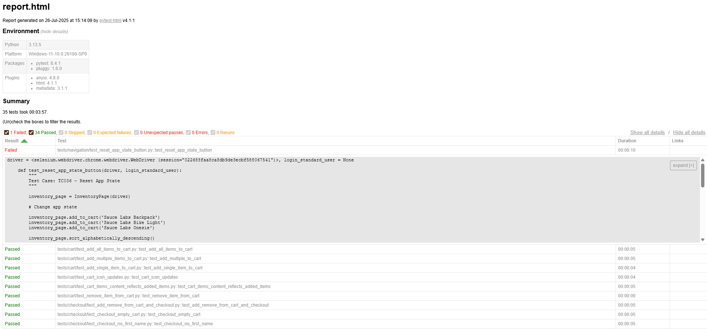

# SauceDemo UI Test Suite

Automated functional UI tests for the [SauceDemo](https://www.saucedemo.com) web application, built using Python, Selenium WebDriver, and PyTest.

This project follows the Page Object Model (POM) pattern to keep tests organized, maintainable, and scalable. Each test case is also documented in a separate markdown file under the `docs` folder.

## Project Purpose

This project serves as a portfolio and practice project for developing real-world UI automation skills with a professional structure and workflow.

## Tech Stack

- Python 3.10+
- PyTest
- Selenium WebDriver
- ChromeDriver
- Page Object Model (POM) pattern

## How to Run the Tests

### 1. Clone the repository

```
git clone https://github.com/rastkojovic/qa-automation-saucedemo.git
cd qa-automation-saucedemo
```

### 2. Set up a virtual environment and install dependencies

```
python -m venv venv
source venv/bin/activate  # or venv\Scripts\activate on Windows
pip install -r requirements.txt
```

### 3. Run the tests

```
pytest tests/
```

## Project Structure

```
qa-automation-saucedemo/
│
├── conftest.py                   # PyTest fixtures 
├── requirements.txt              # Dependencies
├── README.md
│
├── drivers/
│   └── chromedriver.exe          # ChromeDriver executable
│
├── pages/                        # Page Object Model classes
│   ├── base_page.py
│   ├── inventory_page.py
│   ├── login_page.py
│   ├── checkout_info_page.py
│   └── cart_page.py
├── tests/                        # Test files
│   ├── test_add_multiple_items_to_cart.py
│   ├── test_add_single_item_to_cart.py
│   ├── test_cart_icon_updates.py
│   ├── ...
│
└── docs/                         # Manual test cases
    ├── add_single_item_to_cart_test_case.md
    ├── cart_icon_updates_test_case.md
    ├── invalid_login_test_case.md
    ├── ...
```

## Sample Test Report

Below is an example of the automatically generated HTML test report.


To generate a report after running tests, use:

```
pytest --html=report.html --self-contained-html
```

## Features Covered

- Login & Authentication: (valid/invalid/locked-out, logout)
- Cart Functionality: (add, remove, badge updates, cart content accuracy)
- Checkout Process: (complete flow, field validation, edge/negative scenarios)
- Inventory Page: (load, sorting by name/price)
- Input Field Validation: (invalid/missing data)
- Navigation: (burger menu, about, reset app state)
- Social Media Links: (Facebook, Twitter/X, LinkedIn)

## License

This project is licensed under the MIT License. See the [LICENSE](LICENSE) file for details.

## Author

**Rastko**
Aspiring QA Engineer and test automation developer.
